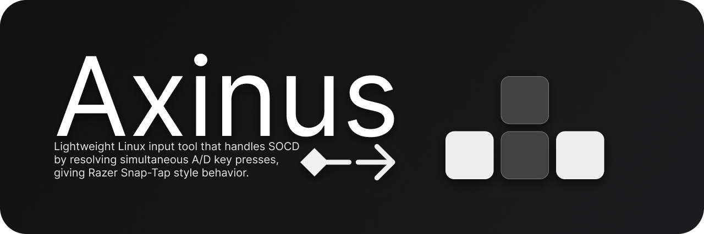

# About
Axinus is a lightweight Linux utility that provides SOCD cleaning for the `A` and `D` keys.

In simpler terms, it's Razer's snap tap or Wooting's SOCD cleaning but supports every keyboard, is opensource and works on Linux.

It also supports both X11 and Wayland since it's independent of them and works at the kernel level.

## Building
Install the required packages:

Debian/Ubuntu:
```bash
sudo apt install build-essential pkg-config libevdev-dev
```
Arch:
```bash
sudo pacman -Syu base-devel libevdev
```
Fedora/RHEL/CentOS:
```bash
sudo dnf install @development-tools pkgconf-pkg-config libevdev-devel
```
Clone, cd and build:
```bash
git clone https://github.com/KernelDash/Axinus
cd Axinus
make
```
Install to /usr/local/bin (optional):
```bash
sudo make install
```
Uninstall `:(`:
```bash
sudo make uninstall
```

## Usage
> Note: Using SOCD cleaning tools is banned in some games, so make sure to first check the rules of the game you're playing.

Axinus takes 1 argument, the event number of your keyboard device. You can find this using tools such as `evtest` or the following command:
```bash
sed -En '/Name=/h;/kbd/{G;s/.*(event[0-9]+).*"(.*)"/\2: \1/p}' /proc/bus/input/devices
```
I use keyd (a key remapping daemon) so I will chose:
```bash
keyd virtual keyboard: event9
```
And use the command:
```bash
sudo axinus 9
```
There you go, now enjoy some snappy movement.
> Note: You can add your user to the input group to be able to use it without sudo.

## Logic
If you are holding `A` and then press `D`, `A` will get virtually released.
If you then release `D`, `A` will be reactivated if it's still being held.
This makes movement feel much more responsive.

## Code
It uses libevdev to listen for input and grab the device so that inputs don't get duplicated, then makes a uinput device using libevdev-uinput and forwards captured events to it with the SOCD logic applied to them.

## Todo
- [ ] Add cleaning for `W` and `S` too.

## License
This program is licensed under the MIT license. For more information check out the `LICENSE` file.
